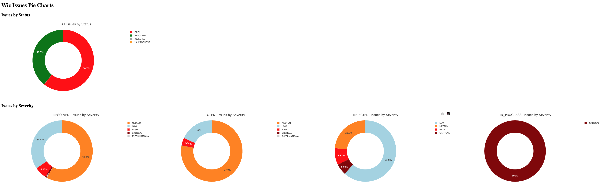
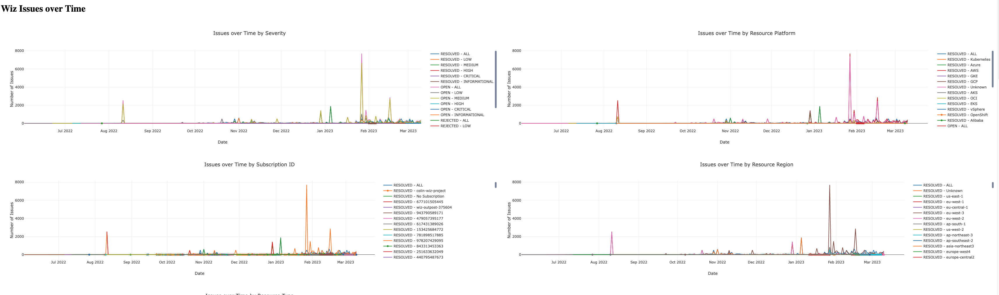

# Goal
Extract the data out of  the Wiz issue report and present it in Pie and Line charts
# IMPORTANT: update the bellow variables on main.py  before running the script. :
```
issue_report --> Path of the wiz issue report in csv
```

## Prerequisites:
- The script is tested on Python 3.10
- Install dash, pandas and plotly packages 
    
## Applicable use cases:
- The purpose of the script is to present the Wiz issue report in Pie and Line charts.

-- Pie charts for Wiz issues by Status, Severity, Project Names, Resource Platform, Subscription ID, Resource Region and the Resource Type.



-- Line charts for Wiz issues over time by Severity, Resource Platform, Subscription ID, Resource Region and Resource Type.




- You can filter charts based on the Wiz Project, Resource Platform and Subscription ID
